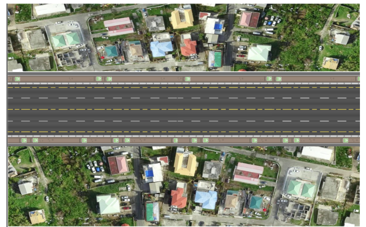
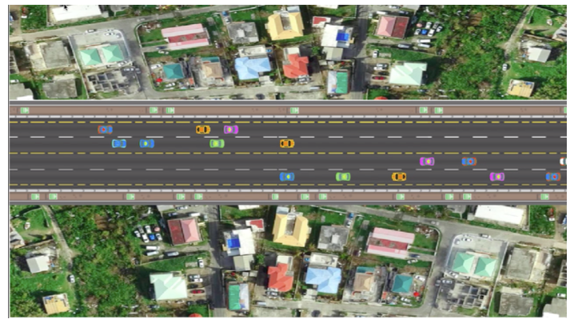
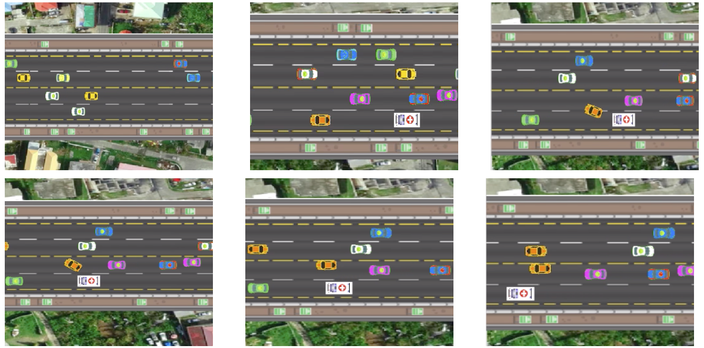
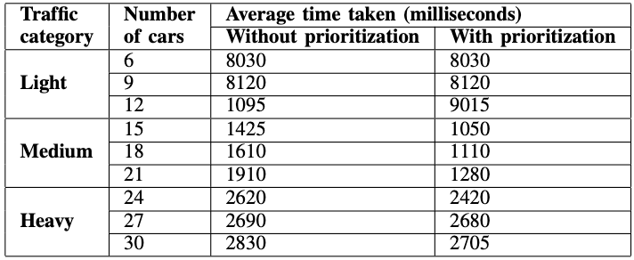

# Simulation of Emergency Vehicle Prioritization in an Autonomous Traffic Environment

- [Simulation of Emergency Vehicle Prioritization in an Autonomous Traffic Environment](#simulation-of-emergency-vehicle-prioritization-in-an-autonomous-traffic-environment)
  * [Overview](#overview)
  * [How to run](#how-to-run)
  * [Vehiclular motion](#vehiclular-motion)
  * [Simulation environment](#simulation-environment)
  * [Evaluation and results](#evaluation-and-results)
  * [Conclusion and future scope](#conclusion-and-future-scope)

## Overview
This project presents a simulation for prioritizing emergency vehicles in traffic where all vehicles are autonomously driven. Multiple approaches have been explored to autonomously detect approaching Emergency Vehicles in traffic in non-autonomous traffic environments. Some approaches use object detection to detect approaching Emergency Vehicles; Others use audio recognition. Furthermore, other approaches suggest combining both of the above to get better results and there are approaches which explain about connecting every vehicle to a network which facilitates communication between every other car for effective traffic flow. We take into account the different considerations in devising prioritization strategies, and present few such strategies in this work. The physics of kinematic motion have been attempted to be implemented to imitate real-life scenarios.

## How to run
1. Install the requirements:

    `pip install -r requirements.txt`
2. Run `simulation_with_prioritization`:

    `python simulation_with_prioritization.py` on command line.

Each run will present a random scenario with Emergency Vehicles on different lanes and the regular vehicles with varying densities.

## Vehiclular motion

We designed our environment with various levels of traffic, and different layouts of roads such as T-junctions, Four-way intersections etc. Based on the different configurations of our environment, we devise prioritization strategies for the emergency vehicles involved and test it through our simulation using time saved as a basis for evaluation. The results of the simulations help us determine the feasibility and desirability for our policy or policies for each configuration.

Our simulation models the autonomous cars in a game-like environment. A game is rendered in a fixed time interval dt based on a global game clock. We model the physics of our autonomous cars in the simulation with a variable acceleration mechanism as often found in games or game-like environments. We model the standard Newtonian Kinematic equations used for determining the position and velocity of an object based on the acceleration applied to it.

In order to move our cars, we vary the acceleration of the car and perform updates on the kinematic state of the car in the fixed time interval `dt`. In each update operation, the velocity and position of each car is changed according to the acceleration applied in that moment. Therefore, the forward motion of the car can be controlled by varying the acceleration of the car. We model the reverse motion of the car by simply reversing the polarity of the acceleration. Similarly, we also model braking behavior through applying a negative acceleration on the current direction of the car’s kinematic motion.
In order to model turning behavior of each car, we supply each car with a dimension of rotation. Rotation is altered via manipulating angular velocity the extent of which is determined by the angular acceleration applied to it at any given moment.
The Steering behaviors modeled for the autonomous cars are based on the standard Kinematic Motion Physics equations for an object’s position, velocity, acceleration, angle, and rotation.

- Position

    The position of a car is not altered directly, but instead every time period dt and update operation is performed using the car’s velocity vector as follows:

    `position update = rotate(car.velocity, car.angle)*dt`

    `car.position = car.position + position update`
    
    The rotate function rotates the velocity vector applied to the car by the angle at which the car is positioned from the horizontal axis. The update operation then applies this velocity vector to the car’s position.

- Velocity

    Similar to the position updates the velocity updates are indirect and are made based on the car’s acceleration at that moment in time.

    `velocity update = car.acceleration ∗ dt`
    
    `car.velocity = car.velocity + velocity update`

- Acceleration

    The kinematic updates are abstracted into four distinct movements for the car based on the four cardinal directions namely, forward, reverse, left, and right. The forward and reverse movement functionalities are responsible for the linear motion of the car. A positive acceleration eventually results in a forward motion i.e. acceleration in the direction to which the car is pointing. Similarly, negative acceleration will result in backward motion i.e. acceleration applied opposite to the direction to which the car is pointing. The acceleration applied to each car at a given moment is decided based on the simulation requirements. The acceleration for each car is capped to a maximum acceleration in order to limit any car from unnaturally over accelerating.

    `car.acceleration = cap acceleration(car.acceleration)`

- Friction

    Friction is modelled as an arbitrary constant negative acceleration applied to the car. The magnitude of Friction deceleration is considerably smaller than the acceleration of the car at any given moment in order to avoid insurmountable Friction that prevents the car from moving. The friction deceleration is defaulted to zero if the acceleration applied to the car at any given moment is zero in order to avoid absurd behavior such as a car moving in the opposite direction solely due to friction. The decelerate function applies the appropriate direction to the friction based on the reverse of the direction of the velocity of the car. The decelerate function also defaults the friction to zero if the car has zero acceleration applied to it at any moment.

    `friction deceleration = decelerate(friction acceleration)`
    
    `car.acceleration = car.acceleration+friction deceleration`
    
- Angular Position

    The left and right movement functionalities are responsible for the steering behavior in the car’s motion which allows for a smooth turning behavior. The left and right movement functionalities alter the angle of the car over a period of time in the anti-clockwise and clockwise directions respectively. The angular velocity of the car is determined using a turning radius and the x component of the velocity since the turn will always occur in the direction horizontal to the car.

    `angular velocity = car.velocity.x/turning radius`

    `angle update = angular velocity ∗ dt` 
    
    `car.angle = car.angle + angle update`

## Simulation environment

<!--  -->

For designing the simulation environment, we pick many layouts, the most elementary among those being a bidirectional road with two lanes in each direction. The traffic in one half moves in the opposite direction to the other half. As seen in Figure 2, we have a snapshot of the environment with cars present on both sides. The Emergency Vehicles used are ambulances and police cars with both of these being visually distinguishable in size and color from the autonomous cars in the traffic. Among the two types of visually distinct cars, The ambulance is a white car and the police car is the blue car.

## Evaluation and results

The above figure displays the prioritization strategy employed to prioritize the Emergency Vehicle in a portion of simulated traffic. The Emergency Vehicle approaches the traffic in the leftmost lane and observes that it is blocked by the orange car in that lane. The prioritization strategy instructs the orange vehicle to clear the lane by steering right and varying accelerations. The orange car must first check to see whether it is safe to switch lanes and based on that information it must vary its acceleration and perform a lane switch as fast as it can without compromising safety. As seen in the snapshots in Figure 7, the orange car performs the lane switch accurately, thereby allowing the approaching Emergency Vehicle to pass with ease.

The project focuses on evaluating whether a policy for prioritizing emergency vehicles in an autonomous environment is efficient and feasible. Here, efficiency refers to the time saved by the emergency vehicles by prioritizing their navigation over other regular vehicles. The performance of the algorithm varies with the density of the traffic. The emergency vehicle prioritization does not distinguish among the type of the emergency vehicle. Ambulance, police car or any other type of emergency vehicles are assigned equal priorities. This means that if an emergency vehicle is in front of another emergency vehicle, there will not be any lane updation for any of those Emergency Vehicle.
The algorithm updates the lane of the car (closely) ahead of the Emergency Vehicle. This ensures minimum reduction in velocity of the Emergency Vehicle. We evaluated the behavior of our prioritization policy in the following types of environments:

- Light traffic

    This scenario uses random initialization of 6 to 12 cars and two emergency vehicles initialized on random lanes. As expected, only a few number of lane clearance by the regular vehicles were executed.

- Medium traffic

    This scenario is simulated using 15 to 21 cars along with two emergency vehicles. This case represents the average traffic conditions with respect to the frequency of the cars. The algorithm provides the best results in this simulation.

- Heavy traffic
    In this scenario, we increased the number of regular cars up to 30 to evaluate the performance of the algorithm in congested traffic. Since, there is less scope for the regular vehicles to give way to the emergency ones by changing lanes, the effect of prioritization policy is not observed significantly.

The table above shows the difference in time taken with and without prioritization. It can be seen that the difference in time for light traffic and heavy traffic is less significant as compared to the difference in time in the case of medium traffic.

## Conclusion and future scope

Since our project is a simulation project, a natural extension to it would be to model as many additional parameters of the real-world affecting motion into the simulation. Parameters that influence the interaction and communication between cars such as weather, malevolent interference, solar flares, technical failures etc. could be added to the simulation for a more comprehensive experiment.
In this project, the major parameter that affects the motion of the cars that we have modelled is natural friction. The values for the hyper parameters that we used such as the maximum acceleration a car can achieve, the magnitude of deceleration caused by friction etc. were subjectively chosen by us. Experiments that determine the effect of varying these hyper-parameters on the simulation would be another contribution to this project.

The project is reduced in scope to a two dimensional simulation which neglects the effect of the shape and size of the individual cars on the simulation. An extension of this project into three dimensional space could provide a more accurate simulation with a higher translatability to the real-world. The number and types of road layouts used in this simulation are limited and subjective. An important consideration for an extension of this project could be a more comprehensive set of layouts that can provide a richer environment to test the prioritization behaviors.

While this project touches on some traffic management behaviors to prioritize Emergency Vehicles, they are not exhaustive. Exploring multiple prioritization strategies could be a valuable contribution to the future of this project. This project also touches upon certain peripheral considerations such as the existence of laws specific to a region which can be exploited to create optimal region-specific prioritization behaviors for Emergency Vehicles.
